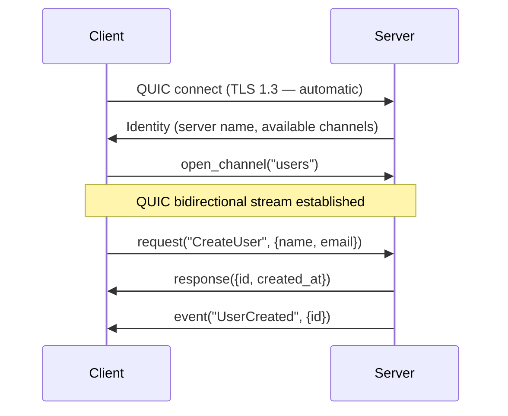

English | [日本語](README.ja.md)

# Unison Protocol

A type-safe QUIC communication framework, defined by KDL schema.

[](https://crates.io/crates/club-unison)
[](https://github.com/chronista-club/club-unison/actions)
[](LICENSE)

```toml
[dependencies]
# crates.io package = `club-unison`, Rust crate identifier = `unison`
club-unison = "1.5.0"
tokio = { version = "1.52", features = ["full"] }
```

```rust
use unison::network::{CertSource, TrustAnchors};
use unison::network::quic::{QuicClient, QuicServer};

// Server: pick the TLS cert source explicitly via the `CertSource` enum.
let server_config = QuicServer::configure_server_with(CertSource::dev_localhost()).await?;

// Client: pick the trust anchor explicitly via the `TrustAnchors` enum.
let client_config = QuicClient::configure_client_with(TrustAnchors::System).await?;

// Internal mesh (fixed pair): one keypair for both ends.
use unison::network::InternalMeshKeypair;
let pair = InternalMeshKeypair::generate(["broker.local".into(), "*.unison.local".into()])?;
// pair.server_cert_source → server side / pair.client_trust_anchors → client side

// Internal mesh (many servers): a private CA issuing per-server certs.
use unison::network::MeshCa;
let ca = MeshCa::generate()?;
let server_cert = ca.issue(["cp.internal".into()])?; // server-side CertSource
let client_trust = ca.trust_anchors();               // shared by every client (one CA to trust)
```

See the [CHANGELOG](https://github.com/chronista-club/club-unison/blob/main/CHANGELOG.md) entries for v0.7.0 (TLS introduced), v0.9.0 (deprecated `configure_*()` removed), and v1.0.0-rc.3 (`MeshCa` private CA) for the trust model design in depth.

---

## What happens when you connect

The flow from connect, to opening a channel, to actually exchanging data:



1. The client opens a QUIC connection. TLS 1.3 certificates are auto-generated for dev.
2. The server replies with its Identity — name, version, and the list of available channels.
3. When the client opens a channel, a QUIC bidirectional stream is established for it.
4. From there, request/response, event push, and raw bytes all flow freely over that one channel.

**Everything is a channel.** There is no separate "RPC" concept — it's unified under `UnisonChannel`.

---

## Writing a server

```rust
use unison::{ProtocolServer, NetworkError};
use unison::network::UnisonChannel;
use serde_json::json;

#[tokio::main]
async fn main() -> Result<(), Box<dyn std::error::Error>> {
    let server = ProtocolServer::with_identity(
        "my-server", "1.0.0", "com.example.myservice",
    );

    // Register a channel handler.
    server.register_channel("users", |_ctx, stream| async move {
        let channel = UnisonChannel::new(stream);
        loop {
            match channel.recv().await {
                Ok(msg) => {
                    channel.send_response(msg.id, &msg.method, json!({"id": "1"})).await?;
                }
                Err(_) => break,
            }
        }
        Ok(())
    }).await;

    // Spawn in the background with graceful-shutdown support.
    let handle = server.spawn_listen("[::1]:8080").await?;
    println!("server up at {}", handle.local_addr());

    // Stop it with `handle.shutdown().await?`.
    Ok(())
}
```

## Writing a client

```rust
use unison::ProtocolClient;
use serde_json::json;

#[tokio::main]
async fn main() -> Result<(), Box<dyn std::error::Error>> {
    let client = ProtocolClient::new_default()?;
    client.connect("[::1]:8080").await?;

    // Open a channel and do a request/response.
    let users = client.open_channel("users").await?;
    let response = users.request("CreateUser", json!({
        "name": "Alice",
        "email": "alice@example.com"
    })).await?;
    println!("user created: {}", response);

    // Receive events on another channel.
    let events = client.open_channel("events").await?;
    while let Ok(event) = events.recv().await {
        println!("event: {:?}", event);
    }

    Ok(())
}
```

---

## UnisonChannel

A single channel supports three communication patterns side-by-side:

```
Client                              Server
  |                                    |
  |-- open_channel("users") ---------> |  (QUIC bidi stream)
  |                                    |
  |<-- UnisonChannel ----------------->|  UnisonChannel
  |    .request()    -> Protocol frame  |    .recv()
  |    .send_event() -> Protocol frame  |    .send_response()
  |    .send_raw()   -> Raw frame      |    .send_raw()
  |    .recv()       <- Protocol frame  |    .recv_raw()
  |    .recv_raw()   <- Raw frame      |
```

```rust
// Request / response.
let res = channel.request("CreateUser", payload).await?;
channel.send_response(id, method, payload).await?;

// Event push (one-way).
channel.send_event("UserCreated", payload).await?;

// Raw bytes — bypasses rkyv/zstd. Useful for audio, etc.
channel.send_raw(&pcm_data).await?;
let data = channel.recv_raw().await?;
```

A single byte at the head of each frame distinguishes Protocol frames (`0x00`, rkyv + zstd) from Raw frames (`0x01`, raw bytes). Payloads larger than 2 KB are automatically compressed with zstd.

---

## Connection events

```rust
let mut events = server.subscribe_connection_events();
tokio::spawn(async move {
    while let Ok(event) = events.recv().await {
        match event {
            ConnectionEvent::Connected { remote_addr, context } => {
                println!("connected: {}", remote_addr);
            }
            ConnectionEvent::Disconnected { remote_addr } => {
                println!("disconnected: {}", remote_addr);
            }
        }
    }
});
```

## KDL schema

Define a protocol in KDL and the Rust / TypeScript code is generated for you:

```kdl
protocol "my-service" version="1.0.0" {
    namespace "com.example.myservice"

    channel "users" from="client" lifetime="persistent" {
        request "CreateUser" {
            field "name" type="string" required=#true
            field "email" type="string" required=#true

            returns "UserCreated" {
                field "id" type="string" required=#true
                field "created_at" type="timestamp" required=#true
            }
        }
    }
}
```

---

## Workspace crates

| Crate | Description |
|-------|-------------|
| [`unison-protocol`](https://github.com/chronista-club/club-unison/tree/main/crates/unison-protocol) | Core library. Published on crates.io as `club-unison`; the Rust crate identifier is `unison`. KDL schema, QUIC, channels, packets. |
| [`unison-agent`](https://github.com/chronista-club/club-unison/tree/main/crates/unison-agent) | [Claude Agent SDK](https://crates.io/crates/claude-agent-sdk) integration. AgentClient, InteractiveClient, MCP tool exposure. |

### unison-agent examples

```bash
cargo run -p unison-agent --example simple_query        # one-shot query
cargo run -p unison-agent --example interactive_chat    # multi-turn conversation
```

## Polyglot clients

The server stays Rust; clients are first-class siblings under [`clients/`](https://github.com/chronista-club/club-unison/tree/main/clients). Wire-format conformance and protocol semantics are owned by this framework, so each client interops byte-for-byte with the Rust server.

| Client | Transport | Distribution |
|--------|-----------|--------------|
| [`clients/typescript`](https://github.com/chronista-club/club-unison/tree/main/clients/typescript) | WebTransport (HTTP/3) | npm `@chronista-club/unison-client` |
| [`clients/ruby`](https://github.com/chronista-club/club-unison/tree/main/clients/ruby) | raw QUIC (FFI → Rust) | RubyGems `unison-client` |
| [`clients/swift`](https://github.com/chronista-club/club-unison/tree/main/clients/swift) | raw QUIC (Apple `NWProtocolQUIC`, ALPN `"unison"`) | SPM (`Package.swift` at repo root) — see note |

> **Swift package consumption**: `Package.swift` は **repo root** にあり (SPM の
> version 指定 remote 依存 `.package(url:from:)` は root manifest を要求するため)。
> source 実体は `clients/swift/` 配下で、root manifest が `path:` で参照する
> (= monorepo にコード集約しつつ SPM 配布も成立)。版数は monorepo の git tag
> (`vX.Y.Z` = Rust workspace 版) に連動する (Swift client は独立 versioning しない)。
>
> ```swift
> .package(url: "https://github.com/chronista-club/club-unison.git", from: "1.5.0")
> // target: .product(name: "UnisonClient", package: "club-unison")
> ```
>
> monorepo 隣接の開発なら path 依存も可: `.package(path: "../club-unison")`。

---

## Development

```bash
git clone https://github.com/chronista-club/club-unison
cd club-unison
cargo build

# Tests (lib unit + integration tests)
RUSTFLAGS="-C symbol-mangling-version=v0" cargo test --workspace
```

**IPv4 / IPv6 both work.** `[::1]:port` (IPv6 loopback), `127.0.0.1:port` (IPv4 loopback), and hostnames (resolved via DNS) all connect. The client picks a local bind address that matches the target's address family. CLI defaults and most examples lean IPv6; if you pass only a bare port (e.g. `8080`) it falls back to `[::1]`.

## Documentation

- [Core concept](https://github.com/chronista-club/club-unison/blob/main/spec/01-core-concept/SPEC.md) — Everything is a Channel
- [Unified Channel Protocol](https://github.com/chronista-club/club-unison/blob/main/spec/02-unified-channel/SPEC.md) — KDL schema, code generation
- [Channel guide](https://github.com/chronista-club/club-unison/blob/main/guides/channel-guide.md) — practical guide

## License

MIT License — [LICENSE](https://github.com/chronista-club/club-unison/blob/main/LICENSE)

---

> **Inspired by**: [Unison](https://www.youtube.com/watch?v=_VIeV_LZXHM) by Captain Houshou Marine ⚓
> The name also carries the meaning of being "on the same waves" — exactly what this framework is for.
