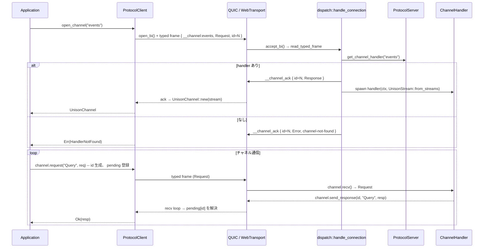

# Unison Protocol アーキテクチャ設計

**最終更新**: 2026-09-05
**ステータス**: Stable (living doc、 workspace の実態に追従させる)

---

## 目次

1. [概要](#1-概要)
2. [ワークスペース構成](#2-ワークスペース構成)
3. [unison-protocol モジュール構成](#3-unison-protocol-モジュール構成)
4. [データフロー](#4-データフロー)
5. [エラーハンドリング](#5-エラーハンドリング)
6. [拡張ポイント](#6-拡張ポイント)

---

## 1. 概要

Unison Protocol は Cargo ワークスペースとして構成され、 コア crate `club-unison`
(lib identifier `unison`) が KDL スキーマの parser、 wire packet、 QUIC / WebTransport
の runtime、 Unified Channel を提供する。 その上に MCP bridge と開発者 CLI が乗り、
TypeScript / Swift / Ruby の client が `clients/` に同居する。 KDL からの型コード生成は
`club-kdl-codegen` crate に分離されている。

---

## 2. ワークスペース構成

```
club-unison/
  Cargo.toml                -- workspace root (edition 2024、 rust-version と version は
                               [workspace.package] が SSOT)
  crates/
    unison-protocol/        -- club-unison: parser / packet / codec / network
    unison-mcp/             -- MCP bridge (bin `unison-mcp`)、 rmcp 3
    unison-cli/             -- 開発者 CLI (bin `unison`): ping / call / sniff / mock / schema lint
  clients/
    typescript/             -- @chronista-club/unison-client (WebTransport、 npm)
    swift/                  -- UnisonClient (SwiftPM、 manifest は repo root の Package.swift)
    ruby/                   -- unison-client gem (Magnus で club-unison を wrap)
  schemas/                  -- KDL: auth / discovery / ping_pong / hierophant
  spec/ design/ guides/     -- What&Why / How / Usage
```

CI (`.github/workflows/ci.yml`) は fmt / clippy (`--lib -D warnings`) / test (ubuntu + macos) /
cargo-deny / MSRV / TS typecheck / cross-language E2E / Swift build+test を回す。

### 主要依存クレート

| 用途 | クレート |
|------|---------|
| シリアライゼーション | serde, serde_json (JSON codec)、 buffa (wire、 protobuf) |
| QUIC / TLS | quinn 0.11, rustls 0.23 (ring), rcgen (自己署名 / mesh CA), webpki-roots |
| WebTransport | wtransport 0.7 (ブラウザ ingress) |
| 圧縮 | zstd |
| 非同期ランタイム | tokio |
| KDL パース | kdl, club-kdl (derive) |
| エラー | thiserror (型付き)、 anyhow (transport 境界) |
| その他 | sha2 (discovery の schema hash)、 uuid (connection id)、 tracing |
| unison-mcp | rmcp 3 (server / transport-io / elicitation)、 schemars |
| unison-cli | clap 4 |

---

## 3. unison-protocol モジュール構成

### 3.1 トップレベル

```
crates/unison-protocol/src/
  lib.rs             -- UnisonProtocol (schema loader + client/server factory)、 主要型の re-export、
                        `proto` (buffa 生成の wire 型を build.rs から include)
  codec/mod.rs       -- Codec / Encodable / Decodable、 JsonCodec、 ProtoCodec
  parser/
    mod.rs           -- SchemaParser、 ParseError
    schema.rs        -- ParsedSchema / Protocol / Channel / Field / FieldType (club-kdl derive)
  packet/            -- UnisonPacket wire frame (design/packet.md)
    mod.rs           -- UnisonPacket
    header.rs        -- UnisonPacketHeader、 PacketType
    flags.rs         -- PacketFlags (COMPRESSED)
    config.rs        -- PacketConfig / CompressionConfig
    serialization.rs -- PacketSerializer / PacketDeserializer、 zstd
  network/           -- runtime (下表)
```

### 3.2 network/ の責務

| module | 責務 |
|--------|------|
| `mod.rs` | `NetworkError` / `ErrorCategory`、 `ProtocolMessage` / `MessageType`、 `UNISON_ALPN`、 re-export |
| `conn.rs` / `conn_quinn.rs` | `UnisonConn` / `UnisonSend` / `UnisonRecv` trait (transport 抽象) と quinn 実装 |
| `webtransport.rs` | wtransport 実装 + `WebTransportServer` (ブラウザ ingress) |
| `frame.rs` | typed frame の wire I/O (`[u32 len][u8 tag][payload]`)、 `__channel_ack` |
| `stream.rs` | `UnisonStream` (transport 非依存の双方向 stream、 handler に渡る型)、 `TypedFrame` |
| `channel.rs` | `UnisonChannel<C>` (request / event / raw、 recv loop、 pending map) |
| `datagram_channel.rs` / `datagram_dispatcher.rs` | `DatagramChannel<C>` と connection 単位の `channel_id` demux |
| `quic.rs` | `QuicClient` / `QuicServer` (builder、 addr 解決、 SNI、 `connect_race` 入口) |
| `dial.rs` | Happy Eyeballs v2 の staggered race (design/happy-eyeballs-dial.md) |
| `dispatch.rs` | 接続ごとの accept loop: identity 送信、 `__channel:` routing、 handler spawn |
| `server.rs` | `ProtocolServer` (handler registry、 接続台帳、 `broadcast`、 `ConnectionEvent`、 listen 系) |
| `client.rs` | `ProtocolClient` (connect / open_channel / open_datagram_channel / auth / `ClientConnectionEvent`) |
| `context.rs` | `ConnectionContext` (connection_id、 identity、 principal、 channel 台帳、 server 発 stream) |
| `identity.rs` | `ServerIdentity` / `ChannelInfo` (`__identity` handshake、 spec/01 §5) |
| `auth.rs` | `unison.auth` 組み込み channel (design/connection-auth.md) |
| `discovery.rs` / `protocol_cache.rs` / `schema_registry.rs` / `dynamic.rs` | `unison.discovery` channel、 KDL 本文 + hash の cache、 runtime 検証、 型なし channel (spec/04) |
| `cert.rs` / `trust.rs` / `mesh.rs` | `CertSource` (server 側 TLS)、 `TrustAnchors` (client 側検証)、 `InternalMeshKeypair` / `MeshCa` |

---

## 4. データフロー

### 4.1 チャネル開設と Request/Response



### 4.2 Identity handshake

接続確立直後に server が `__identity` Event を **server 発の stream** で 1 本送る。 client は
`QuicClient` の `client_accept_bi_loop` でそれを oneshot に流し、 `ProtocolClient::connect` が
`ConnectionContext::set_identity` に保存する。 以後 `server_identity()` で利用可能 channel
一覧が読める (spec/01 §5、 spec/02 §5.1)。

### 4.3 Datagram channel

`register_channel_datagram(name, channel_id, handler)` / `open_datagram_channel(name, channel_id)`
で virtual stream を作る。 wire は `[varint channel_id][codec payload]` で、 packet header も
typed frame も経由しない。 受信は connection 単位の `DatagramDispatcher` が `channel_id` で
mpsc に振り分ける。 `ProtocolServer::broadcast` が全 active connection への配信入口
(design/datagram-channel.md)。

---

## 5. エラーハンドリング

`NetworkError` (thiserror) がネットワーク層の統一 error。 `ErrorCategory`
(transport / protocol / application / resource) は TS SDK と値を揃えた分類で、 retry 可否や
log level の判断に使う。

```rust
pub enum NetworkError {
    Connection(String),                     // 接続断、 stream 非アクティブ
    Protocol(String),                       // 不正メッセージ、 channel 状態 (正常終端もここ、 is_normal_close())
    Serialization(serde_json::Error),       // JSON codec
    Codec(CodecError),                      // Codec trait
    FrameSerialization(SerializationError), // packet (buffa / zstd / version)
    Quic(String),                           // transport 操作 (quinn / wtransport / TLS / bind)
    Timeout,                                // request timeout
    HandlerNotFound { method: String },     // channel-not-found nack
    NotConnected,
    UnsupportedTransport(String),
}
```

transport 直下 (`quic.rs` / `frame.rs` / `stream.rs` / `dispatch.rs` / `cert.rs` / `trust.rs`) は
`anyhow::Result` を使い、 `server.rs` / `client.rs` の境界で `NetworkError::Quic(String)` に
畳んでいる。 この境界は俯瞰 (2026-09-05) の MEDIUM #21 として整理予定。

---

## 6. 拡張ポイント

| 拡張点 | 場所 | 差し込めるもの |
|--------|------|----------------|
| `UnisonConn` / `UnisonSend` / `UnisonRecv` | `network/conn.rs` | transport。 現在 quinn と wtransport の 2 実装 |
| `Codec` + `Encodable<C>` / `Decodable<C>` | `codec/mod.rs` | payload 形式。 `JsonCodec` (serde) と `ProtoCodec` (buffa) |
| `CertSource` / `TrustAnchors` | `network/cert.rs` / `trust.rs` | server 証明書の出所と client の検証方針 (dev_localhost / system / pinned / mesh CA) |
| channel handler | `ProtocolServer::register_channel` / `register_channel_datagram` / `ProtocolClient::register_server_channel` | application protocol そのもの |
| `Verifier` | `ProtocolServer::enable_auth` | 接続 credential の検証 (design/connection-auth.md) |
| discovery | `ProtocolServer::enable_discovery(kdl)` | KDL の runtime 配布 (spec/04) |

trait を新設するより、 `register_channel` に handler を積む方が Unison 流。 独自 transport が
要る場合だけ `UnisonConn` を実装する。
