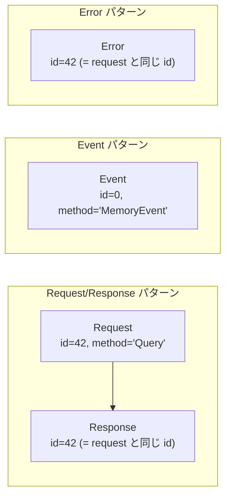
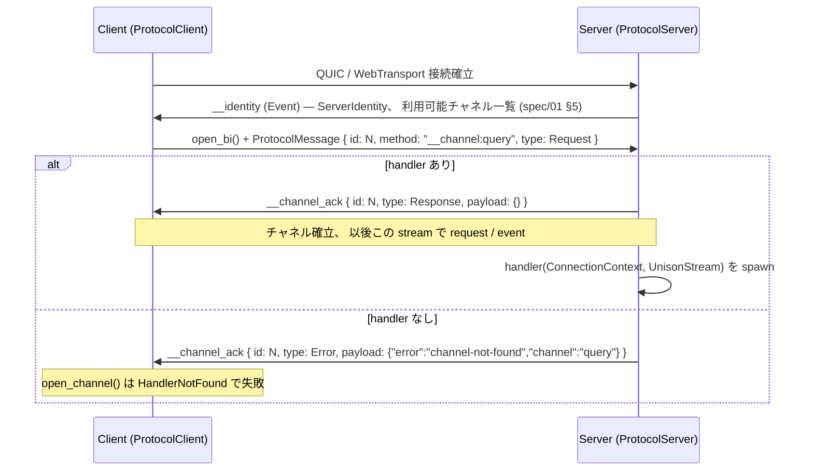
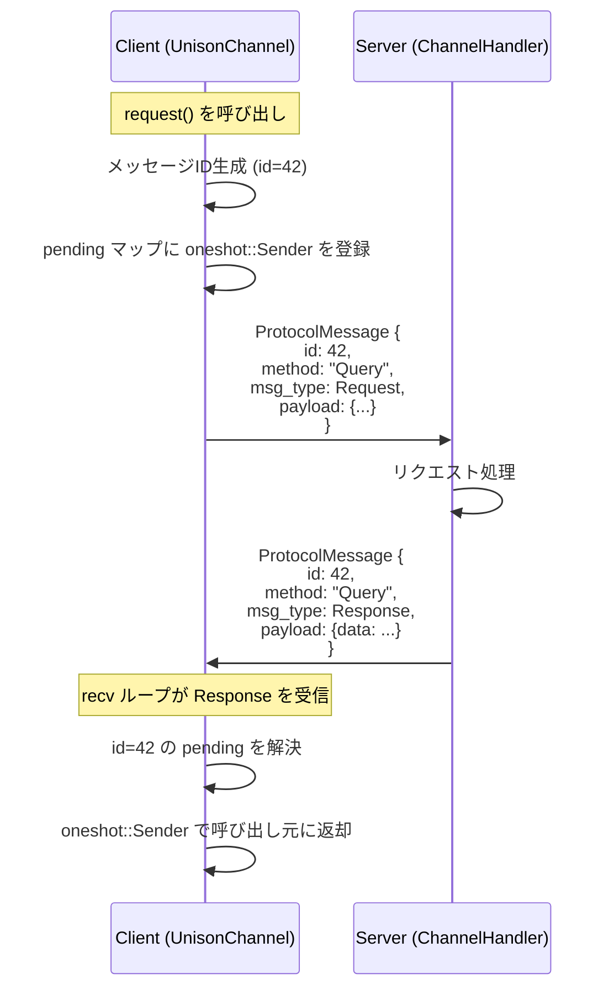
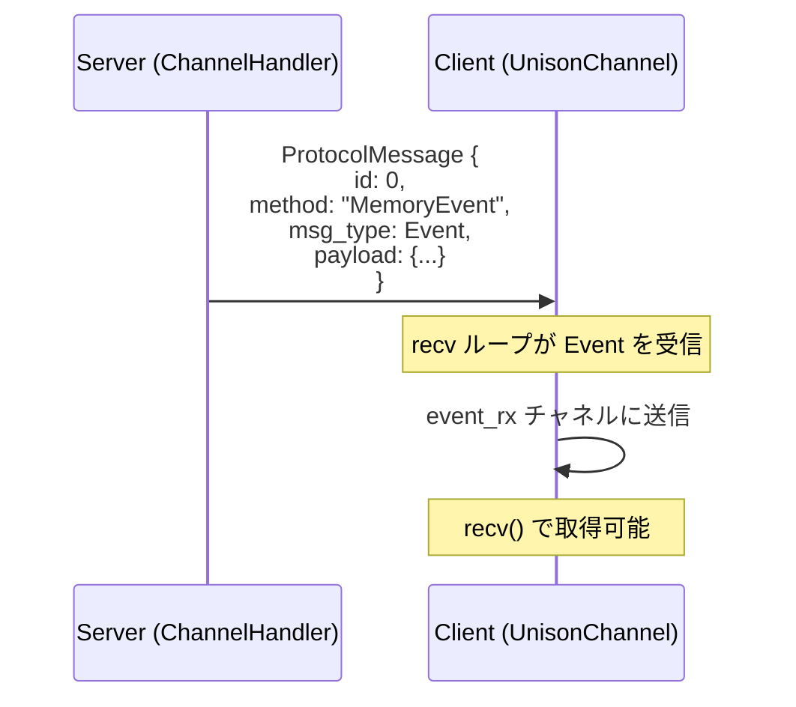
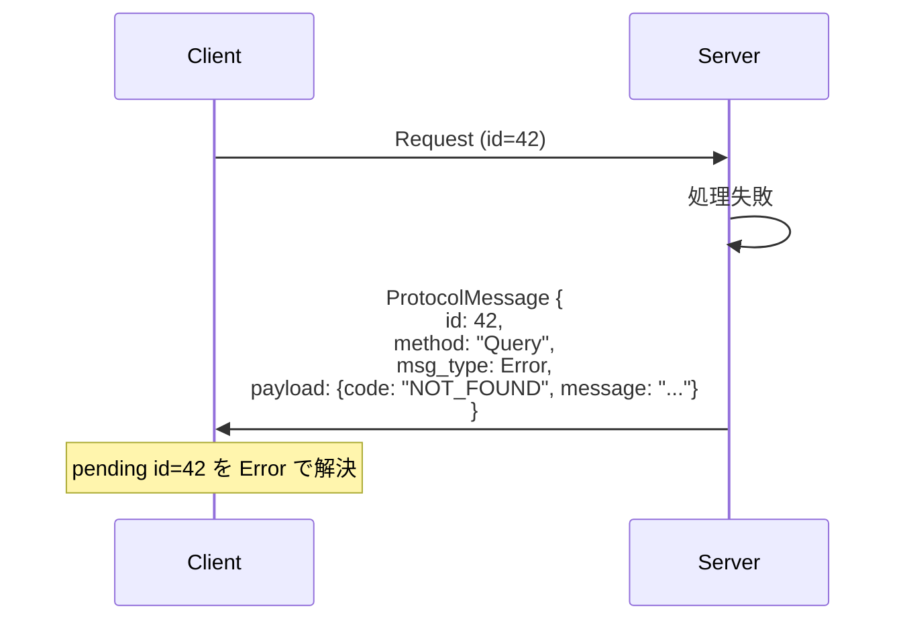

# spec/02: Unison Protocol - Unified Channel プロトコル仕様

**バージョン**: 2.3.0 (旧 spec/03 の channel routing / UnisonChannel API / ConnectionContext を統合、 旧構文互換の記述を撤去)
**最終更新**: 2026-09-05
**ステータス**: Stable (v0.9.0 で 2.0.0 確定)、 additive 拡張中 (datagram channel / request 属性)

---

## 目次

1. [概要](#1-概要)
2. [設計思想](#2-設計思想)
3. [コアメッセージ型](#3-コアメッセージ型)
4. [KDL スキーマ定義言語](#4-kdl-スキーマ定義言語)
5. [メッセージフロー](#5-メッセージフロー)
6. [コード生成](#6-コード生成)
7. [セキュリティ](#7-セキュリティ)
8. [パフォーマンス](#8-パフォーマンス)
9. [バージョニングと互換性](#9-バージョニングと互換性)
10. [今後の拡張](#10-今後の拡張)
11. [関連ドキュメント](#11-関連ドキュメント)

---

## 1. 概要

Unison Protocol の通信層は、**Unified Channel** アーキテクチャに基づく。全ての通信は**チャネル**を通じて行われ、各チャネルは `request`（応答を期待する問い合わせ）と `event`（一方向プッシュ）の2つのメッセージパターンをサポートする。

従来の RPC（`service` / `method`）とストリームチャネル（`channel` / `send` / `recv`）の二重構造を廃止し、チャネル一本に統一することで、プロトコルの複雑さを大幅に削減する。

### 1.1 旧アーキテクチャからの変更点

| 項目 | 旧（v1.x） | 新（v2.0） |
|------|-----------|-----------|
| 通信パターン | RPC (`service`/`method`) + Channel (`send`/`recv`) | **Channel のみ** (`request`/`event`) |
| MessageType | 10 バリアント | **4 バリアント** (Request/Response/Event/Error) |
| ハンドラー登録 | `call_handlers` + `stream_handlers` + `channel_handlers` | **`channel_handlers` のみ** |
| 型生成 | Service trait + `QuicBackedChannel<S,R>` | **`UnisonChannel` のみ** |

### 1.2 アーキテクチャ上の位置づけ

```mermaid
graph TB
    subgraph "アプリケーション層"
        App[アプリケーションコード / channel handler]
    end

    subgraph "チャネル層"
        UC[UnisonChannel&lt;C: Codec&gt;<br/>request + event 統合型]
        DC[DatagramChannel&lt;C&gt;<br/>best-effort event]
    end

    subgraph "ストリーム層"
        US[UnisonStream<br/>transport 非依存の双方向ストリーム]
    end

    subgraph "トランスポート層"
        QUIC[raw QUIC (quinn)]
        WT[WebTransport (wtransport)]
    end

    App --> UC
    App --> DC
    UC --> US
    US --> QUIC
    US --> WT
    DC --> QUIC
```

`UnisonStream` は `UnisonConn` trait (= `accept_bi` / `open_bi` / datagram) の上に乗るため、
raw QUIC と WebTransport のどちらの接続でも同じ `register_channel` ハンドラーが動く。

---

## 2. 設計思想

### 2.1 目標

- **型安全性**: コンパイル時・実行時の型チェック保証
- **開発者体験**: シンプルで直感的な API
- **多言語サポート**: Rust、TypeScript 等への自動コード生成
- **リアルタイム通信**: 低レイテンシー双方向通信
- **拡張性**: 新しいチャネル、メッセージ型の簡単な追加

### 2.2 設計原則

- **スキーマファースト**: KDL プロトコル定義駆動開発
- **非同期優先**: async/await パターンを基盤
- **チャネル統一**: 全通信パターンをチャネルで表現
- **エラー耐性**: 包括的なエラーハンドリングと回復メカニズム
- **トランスポート非依存**: raw QUIC と WebTransport (= ブラウザ ingress) を同一 API で扱う

---

## 3. コアメッセージ型

### 3.1 MessageType

全てのメッセージは 4 つの型に分類される。

```rust
pub enum MessageType {
    Request,    // 応答を期待するメッセージ（メッセージIDで紐付け）
    Response,   // Request に対する応答
    Event,      // 一方向プッシュ（応答不要）
    Error,      // エラー
}
```



### 3.2 ProtocolMessage

全てのプロトコル通信における標準メッセージ形式:

```rust
pub struct ProtocolMessage {
    pub id: u64,               // メッセージID（Requestは一意、Eventは0可）
    pub method: String,        // メソッド名（例: "Query", "MemoryEvent"）
    pub msg_type: MessageType, // メッセージ種別
    pub payload: Vec<u8>,      // Codec (JsonCodec / ProtoCodec 等) でエンコードされたペイロード
}
```

v0.9.0 buffa pivot 後、 `ProtocolMessage` は wire 上で buffa-encoded `proto::ProtocolMessage`
(= `proto/protocol.proto` で定義) として運ばれる。 `payload` は caller が任意の
codec で encode した raw bytes (= JsonCodec → JSON 文字列の bytes、 ProtoCodec →
buffa-encoded bytes)。

### 3.3 Request/Response 相関

メッセージの相関は `ProtocolMessage.id` **だけ** で行う。 Response / Error は元の Request と
**同じ `id`** を持ち、 受信側は pending map (`id → oneshot`) から該当 Request を解決する。
packet header には相関用 field を持たない (= v2.0 で `response_to` 等の未使用 field を削除、
[design/packet.md](../../design/packet.md) §2)。

| 送信側 | id | 意味 |
|--------|-----|------|
| Request | > 0 (送信側が生成、 接続内で一意) | 応答を期待するリクエスト |
| Response | = Request の id | リクエストに対する応答 |
| Error | = Request の id | リクエストに対するエラー応答 |
| Event | 0 | 一方向メッセージ（応答不要） |

---

## 4. KDL スキーマ定義言語

### 4.1 基本型

parser (`parser::FieldType`) が認識する型。 runtime 検証 (`SchemaRegistry`) と
MCP tool schema (`unison-mcp`、 [design/kdl-to-json-schema.md](../../design/kdl-to-json-schema.md)) が
この表に従う。

| 型 | 説明 | JSON Schema | 備考 |
|------|-------------|--------------|------|
| `string` | UTF-8 テキスト | `string` | |
| `int` | 整数 | `integer` | |
| `float` | 浮動小数 | `number` | |
| `bool` | 真偽値 | `boolean` | |
| `json` | 任意の JSON 値 | `{}` (any) | |
| `object` | JSON object | `object` | key / value は untyped |
| `array` | JSON array | `array` (items any) | `array<T>` の typed 要素は未対応 |
| `map` | string key → any value | `object` (additionalProperties) | `map<K, V>` は未対応 |

上記以外の型名 (例: `timestamp`) は **custom 型** として受理され、 検証も schema も
「何でも通る」 (= any) になる。 意味付けは application 側の責務。 旧 docs にあった
`number` は builtin ではない (= custom 扱いで untyped になる) ので、 数値は `int` / `float` を使う。

### 4.2 フィールド修飾子

- `required=#true`: フィールドが必須（デフォルト: false）。 runtime 検証で欠落を reject
- `description="text"`: フィールドドキュメンテーション。 MCP tool schema に流れる
- `default` / `min` / `max` / `min_length` / `max_length` / `pattern`: parser が保持するのみで
  runtime 検証には使わない (= constraint validation は後続 phase)

### 4.3 プロトコル構造

```
Protocol（プロトコル）
├── Metadata（メタデータ） (name, version, namespace, description)
├── Messages（メッセージ） (構造化データ定義)
└── Channels（チャネル）
    ├── request（リクエスト/レスポンス）
    │   └── returns（レスポンス型）
    └── event（一方向イベント）
```

### 4.4 Channel 定義構文

#### 新構文: `request` / `event`

```kdl
channel "<name>" from="<direction>" lifetime="<lifetime>" {
    // Request/Response パターン
    request "<RequestName>" {
        field "<name>" type="<type>" [required=#true]

        returns "<ResponseName>" {
            field "<name>" type="<type>"
        }
    }

    // 一方向イベント
    event "<EventName>" {
        field "<name>" type="<type>" [required=#true]
    }
}
```

#### 属性

| 属性 | 値 | 説明 |
|------|-----|------|
| `from` | `"client"` | クライアントが送信を開始する |
| `from` | `"server"` | サーバーが送信を開始する |
| `from` | `"either"` | 双方が送信可能 |
| `lifetime` | `"persistent"` | 接続中ずっと維持される |
| `lifetime` | `"transient"` | リクエスト単位で開閉される |
| `backend` | `"stream"` | QUIC bidi stream を使う (= default、 ordered + reliable) |
| `backend` | `"datagram"` | QUIC datagram を使う (= unordered + unreliable + ≤MTU)、 `channel_id` 必須 |
| `channel_id` | `1..` | `backend="datagram"` 時の demux 識別子 (= varint encoded prefix)、 author が明示割り当て (= proto3 field number 哲学) |

`backend` のメンタルモデル:

- **1 channel = 1 (virtual) stream**: stream channel は QUIC bidi stream に直接対応、 datagram channel は connection 内の共有 datagram path 上に `channel_id` で識別される **virtual stream** として存在。
- **1 channel = 1 backend (strict)**: 1 channel block 内の event は全て同じ backend に従う。 stream/datagram event の mixed channel は v0.10.0 では disallow (= forward-compatible、 将来許容化可)。
- **互換性**: `backend` 属性なしの v0.9.0 schema は default `"stream"` 解釈で動作、 v0.9.0 caller は無改修。

#### Request 属性

`request` ノードには optional 属性を付与できる:

| 属性 | 値 | 説明 |
|------|-----|------|
| `description` | string | リクエストの人間可読な説明。unison-mcp の MCP tool description 等、AI agent が読む説明文に流れる |
| `readonly` | `#true` / `#false` | 環境を変更しない読み取り専用リクエストであることの宣言 (= safety hint) |
| `destructive` | `#true` / `#false` | 破壊的更新（復元不能な削除・上書き）があり得ることの宣言。`#false` は「追加のみ」の積極表明 (= safety hint) |
| `idempotent` | `#true` / `#false` | 同一引数での再実行が追加の効果を持たないことの宣言 (= safety hint) |

**Safety hints** (`readonly` / `destructive` / `idempotent`) は、channel 作者が自メソッドの副作用特性を宣言し、AI agent 等の consumer がそれを尊重するための仕組み:

- **宣言は optional** — 未宣言は「不明」であり、consumer 側の default 解釈に委ねる。KDL parser は未宣言を `None` として保持し、default 値へ潰さない
- **hint であって enforcement ではない** — protocol runtime は宣言と実際の挙動の一致を検証しない。宣言の信頼性は server 作者への信頼と同一（= untrusted server の hint を security 判断に使わない）
- **矛盾は validation error** — `readonly=#true destructive=#true` の同時宣言は parse 時に拒否される
- **MCP への写像** — unison-mcp bridge は synthesized tool の `ToolAnnotations`（`readOnlyHint` / `destructiveHint` / `idempotentHint`）へそのまま写す。未宣言 hint は MCP spec の default（readOnly=false / destructive=true / idempotent=false）解釈に委ねられる

```kdl
channel "memory" from="client" lifetime="persistent" {
    request "Query" readonly=#true idempotent=#true {
        field "key" type="string"
        returns "Result" { field "value" type="json" }
    }
    request "Delete" destructive=#true {
        field "key" type="string"
        returns "Deleted" { field "ok" type="bool" }
    }
}
```

#### メッセージブロック

| ブロック | 説明 |
|---------|------|
| `request` | Request/Response パターン。応答を期待するメッセージ |
| `returns` | `request` 内にネストし、レスポンス型を定義 |
| `event` | 一方向プッシュメッセージ。応答不要 |

#### スキーマ例

```kdl
protocol "creo-sync" version="2.0.0" {
    namespace "club.chronista.sync"

    // Query チャネル: Request/Response + Event
    channel "query" from="client" lifetime="persistent" {
        request "Query" {
            field "method" type="string" required=#true
            field "params" type="json"

            returns "Result" {
                field "data" type="json"
            }
        }

        event "QueryError" {
            field "code" type="string"
            field "message" type="string"
        }
    }

    // Events チャネル: イベント配信のみ
    channel "events" from="server" lifetime="persistent" {
        event "MemoryEvent" {
            field "event_type" type="string" required=#true
            field "memory_id" type="string" required=#true
            field "category" type="string"
            field "from" type="string"
            field "timestamp" type="string"
        }
    }
}
```

---

## 5. メッセージフロー

### 5.1 チャネル確立 (routing)

チャネルは **1 channel = 1 QUIC bidi stream**。 開設側が新しい bidi stream を開き、 先頭に
`__channel:{name}` の open frame を送る。 受け側は名前でハンドラーを引き、 同じ stream に
ack / nack を 1 本返す。



- `__identity` / `__channel:` / `__channel_ack` の `__` prefix は予約 method (application は使わない)
- ack の `id` は open request の `id` と一致し、 client は自分の open と相関する
- `from="server"` の channel は逆向きで、 server が `ConnectionContext::open_server_stream(name)`
  で stream を開き、 client 側の `register_server_channel(name, handler)` に届く
  ([design/server-initiated-stream.md](../../design/server-initiated-stream.md))
- datagram channel (§8.5) は stream を開かず、 `channel_id` varint prefix で demux する

#### API

```rust
// server: 名前 → handler。 handler は接続ごとに spawn され、 UnisonStream を直接扱う
impl ProtocolServer {
    pub async fn register_channel<F, Fut>(&self, name: &str, handler: F)
    where
        F: Fn(Arc<ConnectionContext>, UnisonStream) -> Fut + Send + Sync + 'static,
        Fut: Future<Output = Result<(), NetworkError>> + Send + 'static;
}

// client: 名前で開き、 ack を待って UnisonChannel を返す
impl ProtocolClient {
    pub async fn open_channel(&self, name: &str) -> Result<UnisonChannel, NetworkError>;
}
```

### 5.2 Request/Response フロー

チャネル内での Request/Response は、メッセージ ID で紐付けられる。



### 5.3 Event フロー

Event は一方向プッシュであり、応答を期待しない。



### 5.4 エラーハンドリング

#### チャネルレベルエラー

| エラー | 原因 | 処理 |
|--------|------|------|
| `HandlerNotFound` | 未登録チャネル名 | Error メッセージを返却 |
| `Protocol` | 不正なメッセージ形式 | Error メッセージを返却 |
| `Timeout` | 応答タイムアウト | pending を Error で解決 |
| `Connection` | QUIC 接続断 | 全 pending を Error で解決 |

#### Request エラー応答



### 5.5 UnisonChannel API

`UnisonChannel<C: Codec = JsonCodec>` が request / event 両パターンを 1 型で提供する
([channel.rs](../../crates/unison-protocol/src/network/channel.rs))。 内部で recv loop を
1 本 spawn し、 `Response` / `Error` は `id` で pending の oneshot へ、 `Event` / `Request` は
`recv()` の queue へ振り分ける。 接続断で loop が終わると残る pending は全て Error で解決される。

```rust
impl<C: Codec> UnisonChannel<C> {
    pub fn new(stream: UnisonStream) -> Self;                       // handler / open_channel が呼ぶ
    pub fn with_request_timeout(self, timeout: Duration) -> Self;   // 既定 30s
    pub async fn request<Req: Encodable<C>, Resp: Decodable<C>>(&self, method: &str, req: &Req)
        -> Result<Resp, NetworkError>;                              // id 生成 → pending → await
    pub async fn send_event<T: Encodable<C>>(&self, method: &str, ev: &T) -> Result<(), NetworkError>;
    pub async fn send_response<T: Encodable<C>>(&self, request_id: u64, method: &str, resp: &T)
        -> Result<(), NetworkError>;                                // handler 側が Request に応える
    pub async fn recv(&self) -> Result<ProtocolMessage, NetworkError>; // Event / Request を受ける
    pub async fn send_raw(&self, data: &[u8]) -> Result<(), NetworkError>; // raw frame (0x01)、 codec / 圧縮なし
    pub async fn recv_raw(&self) -> Result<Vec<u8>, NetworkError>;
    pub async fn close(&self) -> Result<(), NetworkError>;
}
```

`recv()` が `NetworkError::Protocol("Channel closed")` を返したら正常終端
(`NetworkError::is_normal_close()` で判定できる)。

### 5.6 ConnectionContext

接続 1 本につき 1 つ生成され、 全 channel handler に `Arc<ConnectionContext>` で渡る
([context.rs](../../crates/unison-protocol/src/network/context.rs))。

| 項目 | 内容 |
|------|------|
| `connection_id: Uuid` | 接続の一意 ID |
| `identity()` / `set_identity()` | 対向の `ServerIdentity` (client 側で `__identity` 受信後に set) |
| `principal()` / `set_principal()` | 認証済み主体 ([design/connection-auth.md](../../design/connection-auth.md)) |
| `open_server_stream(name)` | server 発 channel の stream を開く (`from="server"`) |
| `register_channel` / `get_channel` / `remove_channel` / `channel_names` | この接続で開いた channel の handle 台帳 |

---

## 6. スキーマの消費者

KDL スキーマは SSOT で、 本 crate の中では **runtime** に消費する。 型コードの生成は本 crate の
責務ではない。

| 消費者 | 場所 | 何をするか |
|--------|------|-----------|
| `SchemaParser` | `parser/` | KDL → `ParsedSchema`。 datagram channel の `channel_id` 必須等の semantic 検証 |
| `SchemaRegistry` | `network/schema_registry.rs` | request / event の payload を runtime 検証 (§4.1 の型、 `required`)。 schema 外の field は許容 (forward-compat) |
| Discovery | `network/discovery.rs`、 [spec/04](../04-discovery/SPEC.md) | server が KDL 本文と hash を client に配る |
| `DynamicProtocol` | `network/dynamic.rs` | 取得した KDL から型なしで channel を開く (= unison-mcp / CLI が使う) |
| `unison-mcp` | `crates/unison-mcp` | request → MCP tool、 `returns` → `output_schema` ([design/kdl-to-json-schema.md](../../design/kdl-to-json-schema.md)) |
| `club-kdl-codegen` | 別 crate | Rust / TypeScript の型生成 |
| TS / Swift / Ruby client | `clients/` | wire 互換の client SDK ([design/typescript-client-api.md](../../design/typescript-client-api.md) 等) |

---

## 7. セキュリティ

### 7.1 認証と認可

- プロトコルレベルの認証は未指定（トランスポートレイヤーの責任）
- チャネルレベルの認可はハンドラー実装で対応
- セッション管理はアプリケーション固有トークンで実現

### 7.2 入力検証

- 必須フィールドの自動検証
- 全パラメータの型チェック
- カスタム検証はハンドラー実装で対応

### 7.3 トランスポートセキュリティ

- QUIC / WebTransport とも TLS 1.3 必須 (= transport が要求する)
- 証明書検証とピン留め
- 接続暗号化と完全性

v0.7.0 以降、 TLS の cert / trust 戦略は **明示選択 API** (`CertSource` / `TrustAnchors`) で表現する。 v0.8.0 で **Builder API** (`QuicServer::builder()` / `QuicClient::builder()`) が推奨形となり、 v0.9.0 で旧 `configure_server()` / `configure_client()` の暗黙 default は削除された。 詳細は [`crate::network::cert`](../../crates/unison-protocol/src/network/cert.rs) / [`crate::network::trust`](../../crates/unison-protocol/src/network/trust.rs) 参照。

---

## 8. パフォーマンス

### 8.1 メッセージサイズ

- JSON ベースのシリアライゼーション
- 典型的なメッセージオーバーヘッド: 100-200 バイト
- 2KB 以上のペイロードは zstd で自動圧縮

### 8.2 レイテンシー

- サブミリ秒のプロトコルオーバーヘッド
- Request/Response はメッセージ ID ベースの即座の相関
- チャネル内 HoL Blocking は許容（シンプルさ優先）

### 8.3 スループット

- チャネル間の独立性により並行処理を最大化
- 非同期ランタイム (tokio) を通じた同時リクエストハンドリング

### 8.4 Wire format (v0.9.0 で buffa pivot 完了)

v0.9.0 で wire format を **rkyv 0.7 archive** から **buffa (Anthropic 製 Protocol
Buffers)** に切り替えた (= breaking change、 詳細は [`CHANGELOG.md`](../../CHANGELOG.md))。
理由:

- **polyglot 親和性**: rkyv は Rust 固有、 buffa は protobuf wire format で多言語 SDK 化が容易
- **schema evolution**: protobuf の field number 互換性で前方/後方互換が取れる
- **Anthropic ecosystem alignment**: buffa は Anthropic 製 protobuf、 club-unison が
  Claude / Anthropic 周辺 tool との接続を取りやすい

#### Wire format 概要

```text
[u32 BE header_len] [buffa-encoded PacketHeader] [payload bytes (may be zstd compressed)]
```

- 先頭 4 byte は header bytes 長 (big-endian u32)
- header 部は [`proto::PacketHeader`](../../crates/unison-protocol/proto/protocol.proto)
  を buffa でエンコードした可変長
- payload 部の長さと圧縮状態は header の `payload_length` / `compressed_length` で表現
- `compressed_length > 0` かつ `flags::COMPRESSED` 立ちで zstd 圧縮されているとみなす
  (= 2KB 以上の payload は自動圧縮)

旧 v0.8 系の rkyv 56-byte fixed header は v0.9.0 で **完全削除** された。

設計詳細は [`design/wire-format.md`](../../design/wire-format.md) と [`design/packet.md`](../../design/packet.md) 参照。

### 8.5 Datagram channel (v0.10.0 で channel API 統合完了)

v0.10.0 で datagram を **channel API narrative に統合** した。 v0.9.0 で導入された
connection-level MVP API (`QuicClient::send_datagram` / `recv_datagram`) は escape
hatch として残存するが、 推奨は KDL schema 経由の datagram channel。

#### Mental model

| | Stream channel | Datagram channel |
|---|---|---|
| **対応 QUIC primitive** | bidi stream | virtual stream (= channel_id で識別、 connection の共有 datagram path) |
| **配送保証** | Ordered + Reliable | Unordered + Unreliable + ≤MTU |
| **HoL blocking** | Channel 内で blocking 許容 | なし (= UDP-like) |
| **MessageType 適合** | Request / Response / Event / Error | **Event** のみ (= 1 方向) |
| **Use case** | RPC、 大規模 stream、 制御フロー | 3DCG transform 大量配信、 heartbeat、 presence |

1 channel = 1 stream のメンタルモデルは backend を超えて維持される: datagram channel は
「`channel_id` で identified された virtual stream」 として concept 上 1 stream に対応。

#### KDL schema

```kdl
channel "position" from="server" lifetime="persistent" backend="datagram" channel_id=1 {
    event "Transform" {
        field "id" type="string"
        field "pos" type="json"   // [x, y, z]
        field "rot" type="json"   // [x, y, z, w]
    }
}
```

- `backend="datagram"` を channel block に指定 (= 全 event が datagram backend)
- `channel_id` を author が **明示割り当て** (= proto3 field number 哲学、 1.. の正整数)
- 1 channel = 1 backend (strict)、 stream/datagram event の mixed channel は v0.10.0 disallow

#### Wire format

```text
[varint channel_id] [buffa-encoded event payload]
```

- payload 先頭 1-2 byte に varint encoded `channel_id` を埋め込み、 受信側で demux
- 残りは buffa (protobuf) で encoded された event message
- 1 datagram = 1 event message、 chunking / fragmentation 不可 (= MTU 超過は send 失敗)

MTU 安全値 **≤1300B** (= IP MTU 1500 - IP/UDP/QUIC header)。 超過すると `SendDatagramError::TooLarge`。

#### API surface

**Server side**:
- `register_channel_datagram(name, channel_id, handler)` — datagram channel handler 登録 (= `channel_id` は KDL schema 由来の varint identifier)
- channel handler 内 `chan.send_event::<T>(event)` で per-connection 送信
- `server.broadcast(channel_name, event)` で全 connected client へ broadcast

**Client side**:
- `client.open_datagram_channel(name, channel_id) -> DatagramChannel<JsonCodec>` — datagram channel open (default codec = JsonCodec)
- `client.open_datagram_channel_with::<C>(name, channel_id) -> DatagramChannel<C>` — 任意 codec 指定版
- `chan.send_event::<T>(event)` — server へ event 送信 (= from="either" / from="client" 時)
- `chan.recv_event::<T>() -> Result<T>` — datagram event 受信

型: `DatagramChannel<C>` は `UnisonChannel<C>` と別型分離、 stream channel と datagram channel は型レベルで区別される (= compile-time safety)。 `channel_id` は KDL schema の `channel_id=N` 属性と同値、 codegen が `(name, channel_id)` を build call に埋め込む。

#### HoL blocking (§8.2 の補足)

§8.2 の「チャネル内 HoL Blocking 許容」 は **stream channel** 前提。 datagram channel は
HoL blocking なし (= UDP-like)、 「stream channel = HoL 許容、 datagram channel = HoL なし」
が spec/02 の規約。

#### Migration: v0.9.0 connection-level API → v0.10.0 channel API

v0.9.0 で導入された `QuicClient::send_datagram` / `recv_datagram` は **escape hatch** として
v0.10.0 でも残存 (= channel API の制約に当てはまらない caller のための低レベル access)。
ただし下記の理由で **新規 caller は datagram channel API を推奨**:

| 観点 | connection-level (v0.9.0) | datagram channel (v0.10.0+) |
|------|---------------------------|------------------------------|
| Demux | caller が payload header で実装 | library が `channel_id` varint prefix で自動 |
| 型 safety | raw `Bytes` | buffa-encoded typed `T` |
| Server-side handler | accept loop 自前 | `register_channel_datagram` で declarative |
| Broadcast | per-connection iterate | `server.broadcast(name, event)` 1 行 |

#### benchmark baseline

`benches/datagram.rs` で `payload {64, 1300} × burst {100, 1000}` の 4 ケース計測。
`benches/RESULTS.md` 参照。 v0.10.0 で channel API 経由の bench 追加予定 (= demux overhead 計測)。

#### v0.11+ 拡張

- 同一 KDL channel 内の mixed backend (= stream + datagram event 共存) を許容化検討
- Datagram channel に subscription model 導入 (= server-side filter)

---

## 9. バージョニングと互換性

### 9.1 プロトコルバージョニング

- セマンティックバージョニング（MAJOR.MINOR.PATCH）
- v2.0.0: Unified Channel への移行（破壊的変更）

### 9.2 後方互換性

- 旧 `service` / `method` / `send` / `recv` 構文は **認識しない** (parse error)。 移行は
  [guides/migration.md](../../guides/migration.md)
- 新しいオプションフィールドの追加: 互換 (受信側は schema 外 field を許容)
- 新しい `request` / `event` の追加: 互換

### 9.3 前方互換性

- デシリアライゼーション時に不明フィールドは無視
- 不明メソッドは `Error` メッセージで応答
- バージョン不整合ハンドリング

---

## 10. 今後の拡張

### 10.1 計画中の機能

- **スキーマ進化**: 実行時スキーマ更新とマイグレーション
- **バッチ操作**: 単一チャネルでの複数リクエスト並行実行
- **チャネルメトリクス**: スループット、レイテンシー、エラー率の自動計測

### 10.2 言語サポート拡張

- TypeScript クライアント・サーバー生成の完成
- Python、Go 等への展開

---

## 11. 関連ドキュメント

### 仕様書

- [spec/01: コアコンセプト](../01-core-concept/SPEC.md) - トランスポート層（QUIC）、 ServerIdentity
- [spec/04: Discovery](../04-discovery/SPEC.md) - KDL の runtime 配布

### 設計ドキュメント

- [design/wire-format.md](../../design/wire-format.md) / [design/packet.md](../../design/packet.md) - wire layout
- [design/datagram-channel.md](../../design/datagram-channel.md) - datagram channel
- [design/server-initiated-stream.md](../../design/server-initiated-stream.md) - `from="server"` channel
- [design/kdl-to-json-schema.md](../../design/kdl-to-json-schema.md) - 型表の JSON Schema 写像
- [KDL スキーマ例](../../schemas/) - 実際のスキーマ定義

### ガイド

- [guides/channel-guide.md](../../guides/channel-guide.md) - Rust 側 UnisonChannel API の使い方

### 参考資料

- [KDL 仕様](https://kdl.dev/)
- [JSON スキーマ](https://json-schema.org/)

---

**仕様バージョン**: 2.3.0
**最終更新**: 2026-09-05
**ステータス**: Stable
