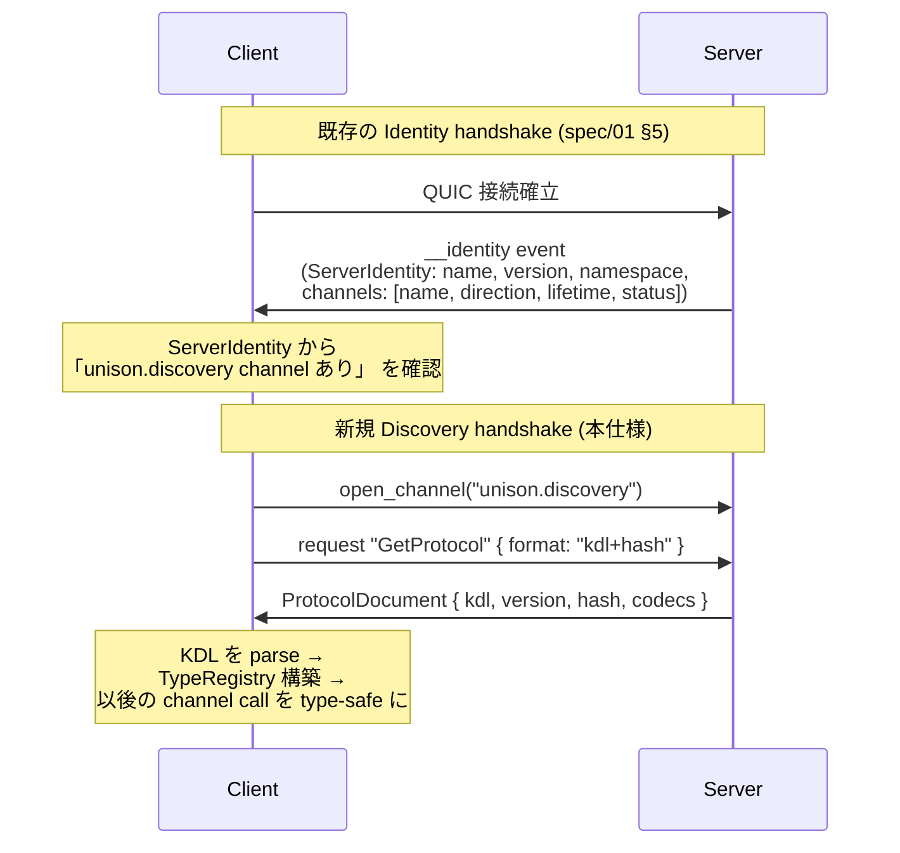
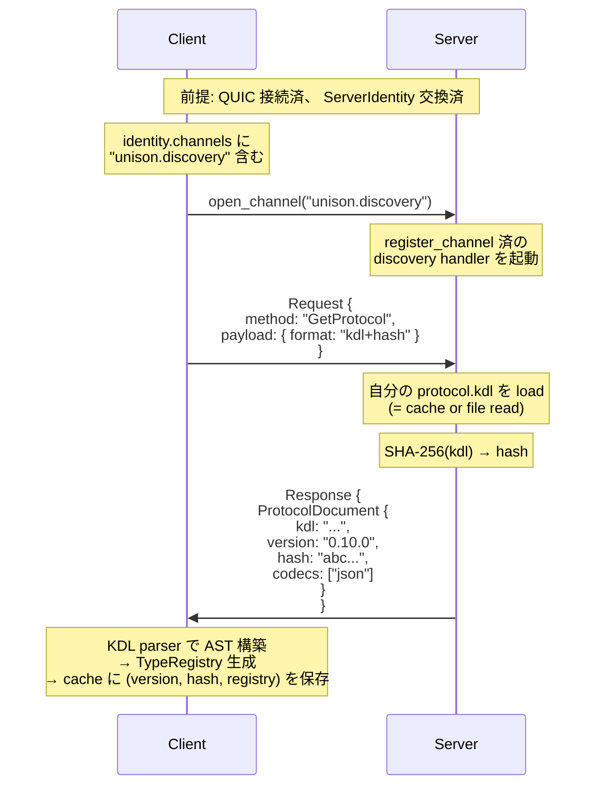
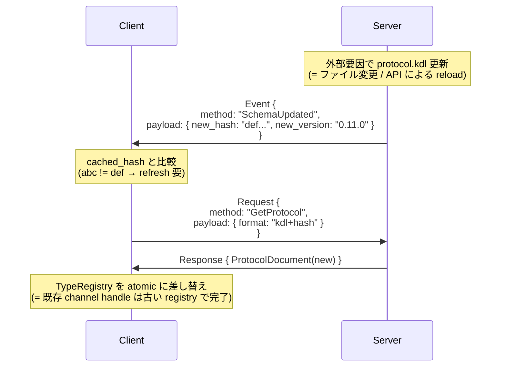
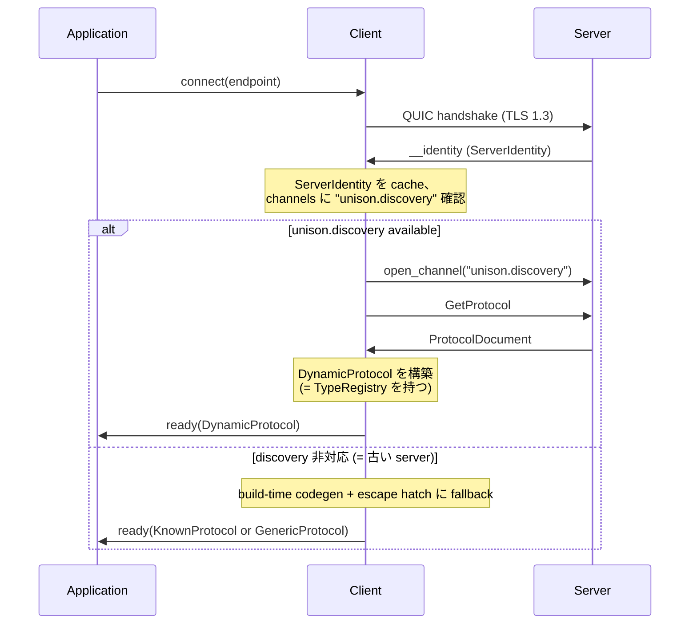

# spec/04: Unison Protocol - Schema Discovery (Unison Hailing)

**バージョン**: 0.1.0-draft
**最終更新**: 2026-05-27
**ステータス**: Draft (Unison Hailing Epic P0、 仕様確定 phase)

---

## 目次

1. [概要](#1-概要)
2. [設計思想](#2-設計思想)
3. [ServerIdentity との関係](#3-serveridentity-との関係)
4. [KDL Channel 定義](#4-kdl-channel-定義)
5. [メッセージフロー](#5-メッセージフロー)
6. [Bootstrap codec (= JSON 固定)](#6-bootstrap-codec--json-固定)
7. [Schema hash と stale 検知](#7-schema-hash-と-stale-検知)
8. [Client 側 TypeRegistry 構築 (informational)](#8-client-側-typeregistry-構築-informational)
9. [Out of scope (= 後続 Epic / phase)](#9-out-of-scope--後続-epic--phase)
10. [関連ドキュメント](#10-関連ドキュメント)

---

## 1. 概要

Unison Schema Discovery (= Unison Hailing) は、 server が自身の **protocol KDL** を runtime で client に配信し、 client が unknown peer に対しても type-safe に channel 通信できる仕組みである。

### 1.1 動機

現状 (v0.10.x) の Unison では:

- **build-time codegen**: KDL ソースから Rust / TypeScript の型を生成し、 client は **既知の peer** に対しては type-safe に通信できる
- **ServerIdentity** ([spec/01 §5](../01-core-concept/SPEC.md#5-identity---serveridentityによるノード認証)): 接続時に server が **channel listing** (= name / direction / lifetime / status) を返す

しかし以下が解けない:

- **unknown peer 接続**: 接続先の KDL を持っていない client は、 generic な escape hatch (= `client.open_channel(name).request(method, payload)`) でしか喋れず、 型検証が無い
- **schema evolution**: server が schema を更新したとき、 client は redeploy しないと新 channel を type-safe に呼べない
- **AI agent からのアクセス**: MCP / Anthropic Messages API tool / Structured Output 等の ecosystem は **JSON Schema を共通通貨** にしており、 KDL の build-time codegen だけでは届かない

### 1.2 ゴール

server が `unison.discovery` channel 経由で **完全な protocol KDL** を配信し、 client が:

- runtime に **TypeRegistry** を構築して payload を validate / encode できる
- KDL を **JSON Schema** に変換して MCP tool / Anthropic structured output ecosystem に流せる
- schema hash で stale 検知し、 必要に応じて refetch / refresh できる

### 1.3 非ゴール (= 本 spec のスコープ外、 §9 参照)

- SchemaUpdated event の actual emit (= hot reload semantics の本体)
- codec negotiation (= JSON 以外の wire codec を runtime で選ぶ)
- signing / trust (= 配信 KDL の偽装検知)
- partial schema fetch / diff-based update

---

## 2. 設計思想

### 2.1 schema as protocol substrate

「protocol は build-time に固定される設計図」 ではなく、 **runtime に流通する substrate** として扱う。 KDL は server が自分の仕様を語る言葉であり、 client (= human dev / LLM agent / federated peer) は その言葉を聞き取れれば対話できる。

### 2.2 KDL as lingua franca

KDL を 「型情報を含む構造化された schema 表現」 として 1 つの primitive にする。 同じ KDL から:

- Rust 型 (= build-time codegen)
- TypeScript 型 + Zod schema (= build-time codegen)
- JSON Schema (= MCP tool input / Anthropic structured output / OpenAI response_format / Vercel AI SDK generateObject)
- runtime TypeRegistry (= 本 discovery の deliverable)

すべて派生する。 KDL の rich type (= union / nested / refinement) は **JSON Schema Draft 7+ 準拠** で表現可能な範囲で best-effort、 lossy 部分は document 化する。

### 2.3 ServerIdentity との分業

Discovery は ServerIdentity を **置き換えない**。 ServerIdentity は接続時に server が自発的に push する 「私はこういう channel を持っています」 という名刺。 Discovery channel はその先で 「では各 channel をどう叩けばいいですか」 を尋ねる対話。

| 質問 | 答える primitive |
|---|---|
| 「どの channel が使えるか」 | ServerIdentity.channels (= listing) |
| 「各 channel をどう叩くか (= method / field / type)」 | unison.discovery.GetProtocol (= full KDL) |
| 「schema が更新されたか」 | unison.discovery.SchemaUpdated event (= future) |

### 2.4 escape hatch との関係

`unison-mcp-probe` の `unison_call(channel, method, payload)` のように、 client が schema を知らなくても generic に channel を叩く path は **escape hatch として残す**。 Discovery は typed primary、 escape hatch は generic secondary。 両刀。

---

## 3. ServerIdentity との関係

### 3.1 補完関係



### 3.2 ServerIdentity が discovery を含んでいることの確認

Server は `ServerIdentity.channels` に `unison.discovery` channel を含めて返す責務を持つ。 これにより client は接続直後に discovery が available か判定できる:

```rust
let identity = client.server_identity().await?;
let has_discovery = identity.channels.iter().any(|c| c.name == "unison.discovery");
if has_discovery {
    let doc = client.open_channel("unison.discovery").await?
        .request("GetProtocol", json!({ "format": "kdl+hash" })).await?;
    // ... TypeRegistry 構築
}
```

discovery 非対応 server (= 古い / opt-out) に対しては client は build-time codegen + escape hatch にフォールバックする。

---

## 4. KDL Channel 定義

### 4.1 完全定義

`schemas/discovery.kdl` の正規定義を引用 (= SSOT は schema ファイル側):

```kdl
protocol "unison-discovery" version="0.1.0" {
    namespace "club.chronista.unison.discovery"

    channel "unison.discovery" from="client" lifetime="persistent" {
        request "GetProtocol" {
            field "format" type="string" required=#true
            returns "ProtocolDocument" {
                field "kdl" type="string" required=#true
                field "version" type="string" required=#true
                field "hash" type="string" required=#true
                field "codecs" type="json" required=#true
            }
        }
        event "SchemaUpdated" {
            field "new_hash" type="string" required=#true
            field "new_version" type="string"
        }
    }
}
```

### 4.2 各フィールドの仕様

#### `GetProtocol.format` (request)

| 値 | 意味 | v0.1.0 挙動 |
|---|---|---|
| `"kdl"` | 生 KDL ソースのみ要求 | ProtocolDocument を返す (= hash は server が常に計算する) |
| `"kdl+hash"` | hash 検証付き | 同上 (= v0.1.0 では差なし、 future hint として残置) |

未知 format は server が `Error` で reject する。

#### `ProtocolDocument.kdl`

server が公開する **protocol 全体** の KDL ソース。 必ず `protocol "<name>" version="<v>" { ... }` トップレベル構造を持つ。 server は自分が `register_channel` した全 channel を含む KDL を返す責務がある。

#### `ProtocolDocument.version`

`kdl` 内の `protocol "..." version="..."` の version 値と一致する。 client が cache key として使う想定。

#### `ProtocolDocument.hash`

`kdl` フィールドの本文を UTF-8 bytes として SHA-256 で hash した値の hex (= 64 文字、 lowercase)。 改行 / 空白を含めた byte-exact hash であり、 client が cache validation に使う。

#### `ProtocolDocument.codecs`

server が wire 上で受理する codec の名前一覧。 v0.1.0 は `["json"]` 固定 (= §6 参照)。 future の codec negotiation で `["json", "proto", "buffa"]` 等に拡張される。 client は配列の **最初の要素** を default codec として採用する想定。

#### `SchemaUpdated.new_hash` (event、 v0.1.0 では emit されない)

新しい protocol KDL の hash。 受信側 client は `new_hash != cached_hash` を確認し、 必要に応じて `GetProtocol` を再発行する。

#### `SchemaUpdated.new_version` (optional)

新しい version 値。 informational (= cache key を pre-compute するための hint)。

---

## 5. メッセージフロー

### 5.1 GetProtocol (基本フロー、 v0.1.0 で実装)



### 5.2 SchemaUpdated (hot reload、 v0.1.0 仕様のみ、 emit は別 Epic)



### 5.3 combined handshake (= Discovery 対応 client の典型起動)



---

## 6. Bootstrap codec (= JSON 固定)

### 6.1 なぜ JSON 固定か

Discovery channel 自身が 「server が話せる codec を聞く」 channel である以上、 **codec negotiation の前提となる 1 つの codec** が必要。 鶏卵問題を以下で解く:

- **v0.1.0 の `unison.discovery` channel は JSON codec 固定**
- `ProtocolDocument.codecs` field で server が話せる他 codec を申告
- client は ProtocolDocument 受信後、 **他 channel に対して** は申告された codec で会話可能

→ Discovery channel 自身は永続的に JSON、 他 channel は negotiation 後の codec を使う、 という 2 層構造。

### 6.2 JSON を選んだ理由

| 候補 | 選定 |
|---|---|
| JSON | ✅ ほぼ全 language / framework で parse 可能、 KDL 内の typed payload を表現可能、 既存 unison protocol の default codec |
| Protobuf (buffa) | ❌ schema 配布前に proto descriptor が必要 = 鶏卵化が悪化 |
| MessagePack / CBOR | ❌ schema-less 動作可能だが ecosystem 親和性が JSON より弱い |

### 6.3 codecs field の意味と将来拡張

v0.1.0 は `codecs: ["json"]` 固定。 v0.x+ で:

- `["json", "proto"]` → client は proto を選んで proto codec channel を開ける
- `["json", "buffa"]` → buffa-encoded channel が available
- 順序は server 優先度 (= 最初の要素を default 推奨)

codec negotiation の本実装は別 Epic (= Hailing-α scope 外、 §9 参照)。

---

## 7. Schema hash と stale 検知

### 7.1 hash の計算

```
hash = lowercase_hex(SHA-256(kdl_utf8_bytes))
```

- `kdl_utf8_bytes`: `ProtocolDocument.kdl` フィールド本文を UTF-8 として bytes 化
- 改行 (CRLF / LF) / 末尾空白も含めた **byte-exact** hash
- hex は 64 文字 lowercase で固定

### 7.2 client cache strategy

```mermaid
flowchart TD
    START[GetProtocol 結果取得] --> CHECK_CACHE{cache に<br/>同 version あり?}
    CHECK_CACHE -->|No| BUILD[KDL parse + TypeRegistry 構築]
    CHECK_CACHE -->|Yes| HASH_CMP{hash 一致?}
    HASH_CMP -->|Yes| USE_CACHE[cache の TypeRegistry を使用]
    HASH_CMP -->|No| BUILD
    BUILD --> STORE[cache に <br/>(version, hash, registry) を保存]
    STORE --> USE_CACHE
```

### 7.3 mismatch 時の挙動

- **stale schema 検知** (= client が古い hash で channel を open しようとした): server は `Error` を返す or 古い registry のままで動作継続 (= v0.1.0 では後者、 backward compat 優先)
- **client が新しい hash を持っていた**: server から見て unknown channel.method、 通常の `HandlerNotFound` error path

詳細な fail mode は別 Epic (= hot reload semantics と一緒に詰める) で確定する。 v0.1.0 では 「client が起動時に 1 度 fetch、 接続中は fix」 が想定。

---

## 8. Client 側 TypeRegistry 構築 (informational)

本 spec は wire protocol 仕様。 client 側 API は **Hailing-α P2-Rust** ([creo-memories mem_1CbSyAVTPMSJyKrRfeUe8s](...)) で別途 detail 化する。 ここでは informational に流れを示す。

```rust
// 1. Discovery channel を open
let chan = client.open_channel("unison.discovery").await?;

// 2. GetProtocol で ProtocolDocument を受信
let doc: ProtocolDocument = chan.request("GetProtocol", json!({
    "format": "kdl+hash"
})).await?;

// 3. KDL parser で AST 構築
let ast = unison::parser::parse(&doc.kdl)?;

// 4. TypeRegistry を構築 (= request/event 名 → field schema の map)
let registry = TypeRegistry::from_ast(&ast)?;

// 5. DynamicProtocol を return
let proto = DynamicProtocol::new(client, registry, doc.hash, doc.codecs);

// 6. 以後の channel call は registry validate を経由
let result = proto.call("memory.search", json!({ "query": "..." })).await?;
//                       ^^^^^^^^^^^^^^^ runtime validate against registry
```

---

## 9. Out of scope (= 後続 Epic / phase)

本 spec で **意図的に確定しない** 項目:

| 項目 | 確定 phase / Epic |
|---|---|
| `SchemaUpdated` event の actual emit semantics | Hailing-α P4 (hot reload) — 別 Epic 候補 |
| Codec negotiation の本実装 (= JSON 以外の wire codec selection) | 別 Epic 「Hailing codec negotiation」 |
| Signing / trust (= 配信 KDL の偽装検知) | 別 Epic 「Hailing trust」 |
| Partial schema fetch (= 1 channel だけ要求) | 別 Epic、 token cost 最適化目的 |
| Diff-based update (= patch protocol) | 別 Epic、 大規模 schema 向け |
| LLM-native payload generation (= structured output 連携) | Hailing-δ spark (= [[mem_1CbSyUr2Pg4dY6Yq3Gkztt]]) |
| Federation discovery (= peer 間 schema 相互理解) | Hailing-γ 候補 |
| Browser dynamic client (= TS SDK DynamicProtocol) | Hailing-β 候補 |

これらは Hailing-α MCP demo の Epic close 後、 個別に spark / Epic 化して進める。

---

## 10. 関連ドキュメント

### 仕様書

- [spec/01: Core Concept](../01-core-concept/SPEC.md) — ServerIdentity (§5)、 QUIC 通信
- [spec/02: Unified Channel](../02-unified-channel/SPEC.md) — KDL 構文、 MessageType、 channel mechanics
- [spec/03: Stream Channels](../03-stream-channels/SPEC.md) — UnisonChannel API、 routing

### Schema

- [schemas/discovery.kdl](../../schemas/discovery.kdl) — 本 channel の KDL 定義 (SSOT)
- [schemas/hierophant.kdl](../../schemas/hierophant.kdl) — KDL 記法 reference (parallel example)
- [schemas/ping_pong.kdl](../../schemas/ping_pong.kdl) — minimal KDL reference

### 実装 (= 本 spec の implementation 対応箇所、 Hailing-α P1-P3c で実装)

- [crates/unison-protocol/src/network/server.rs](../../crates/unison-protocol/src/network/server.rs) — `register_channel` API (line 230)、 built-in `ping` channel example (line 612)
- [crates/unison-protocol/src/network/identity.rs](../../crates/unison-protocol/src/network/identity.rs) — ServerIdentity / ChannelInfo
- [crates/unison-mcp-probe/](../../crates/unison-mcp-probe/) — 既存 MCP probe (Hailing-α P3 で deprecated 予定)、 `unison_channel_list` TODO ([tools.rs:6](../../crates/unison-mcp-probe/src/tools.rs)) を本 spec の P1 が埋める

### Epic 文脈 (creo-memories)

- Spark: Unison Schema Discovery vision (mem_1CbSqGUyM6bJ6ieGrTAg3E)
- Epic: Unison Hailing (mem_1CbSy5x2fFsrdZXaXcuLLr)
- Spark: Hailing-δ LLM-native payload (mem_1CbSyUr2Pg4dY6Yq3Gkztt)
- P0 task: 本 spec doc + schemas/discovery.kdl (mem_1CbSy8KaVzFbaoLqTAMKyR)

---

**仕様バージョン**: 0.1.0-draft
**最終更新**: 2026-05-27
**ステータス**: Draft (Hailing-α P0 完了時に Stable 昇格、 P3c MCP demo 完了時に v0.1.0 GA)
